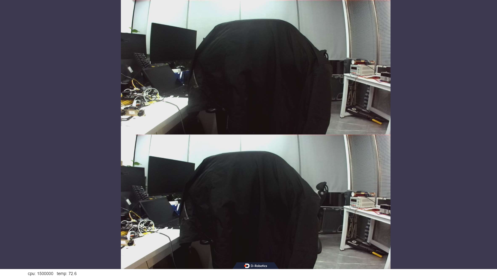

# hobot_zed_cam

## 描述

启动zed相机，并发布分辨率为1280×640、格式为nv12的双目图像

## 编译

参考：[zed-open-capture](https://github.com/stereolabs/zed-open-capture)

1. 安装依赖项，在RDK X5板端执行

```shell
sudo apt install libusb-1.0-0-dev libhidapi-libusb0 libhidapi-dev
```

2. 编译，在RDK X5板端执行

```shell
source /opt/tros/humble/setup.bash
colcon build --packages-select hobot_zed_cam
```

## 运行

```shell
source /opt/tros/humble/setup.bash
source ./install/setup.bash

ros2 launch hobot_zed_cam pub_stereo_imgs_nv12.launch.py
```

在浏览器输入[http://ip:8000](http://ip:8000)即可查看zed输出的双目图像



