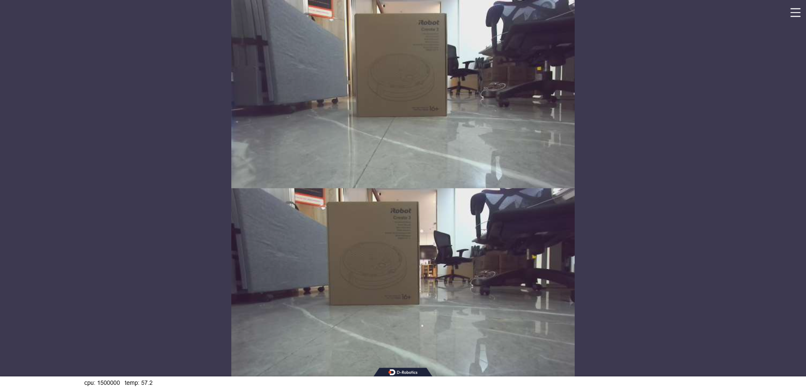
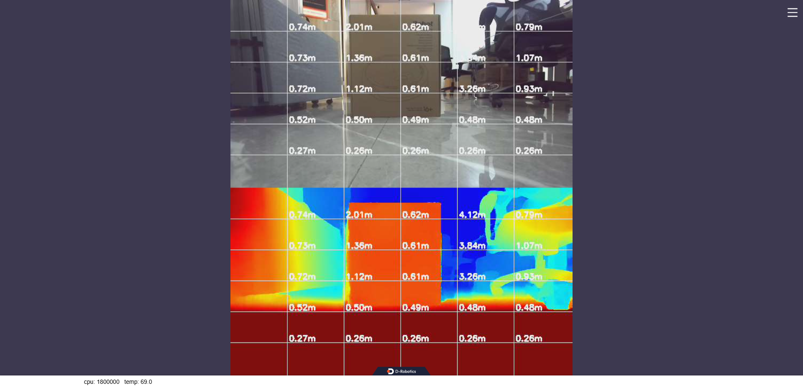

# hobot_zed_cam

## 描述

启动zed相机，并发布双目图像

## 编译

依赖：

0. 参考

- ZED相机SDK：[zed-open-capture](https://github.com/stereolabs/zed-open-capture)
- 地瓜双目算法：[hobot_stereonet](https://github.com/D-Robotics/hobot_stereonet)

1. 安装依赖的库文件，在RDK X5板端执行

```shell
# 如果RDK板端可以联网，可执行apt下载依赖的库文件
sudo apt install libusb-1.0-0-dev libhidapi-libusb0 libhidapi-dev

# 如果不能联网，则执行如下命令将库文件复制到对应目录
cp -rv ./hidapi/* /usr/
```

2. 编译，在RDK X5板端执行

```shell
source /opt/tros/humble/setup.bash
colcon build --packages-select hobot_zed_cam
```

3. 安装udev文件，在RDK X5板端执行（可选），该文件可以在zed相机通过usb接入RDK X5时定义一些设备规则

```shell
cd hobot_zed_cam/udev
bash install_udev_rule.sh
```

## 运行

### (1) 只启动zed相机，发布双目图像

```shell
source /opt/tros/humble/setup.bash
source <hobot_zed_cam的编译路径>/install/setup.bash

# 发布矫正前的图像
ros2 launch hobot_zed_cam pub_stereo_imgs.launch.py

# 加载zed自带的标定参数，发布矫正后的图像，通过dst_width、dst_height参数控制矫正后图片的分辨率
ros2 launch hobot_zed_cam pub_stereo_imgs.launch.py need_rectify:=true

# 加载自定义标定文件，发布矫正后的图像，通过dst_width、dst_height参数控制矫正后图片的分辨率
ros2 launch hobot_zed_cam pub_stereo_imgs.launch.py need_rectify:=true user_rectify:=true stereo_calib_file_path:=./stereo_8_zed_2i.yaml

# 以上启动文件均可加入参数resolution控制zed本身发布图像的分辨率，但最终发布图像的分辨率由参数dst_width、dst_height控制，例如：
ros2 launch hobot_zed_cam pub_stereo_imgs.launch.py need_rectify:=true resolution:=720p dst_width:=640 dst_height:=352

ros2 launch hobot_zed_cam pub_stereo_imgs.launch.py need_rectify:=true user_rectify:=true stereo_calib_file_path:=./stereo_8_zed_2i.yaml \
resolution:=720p dst_width:=640 dst_height:=352
```

在浏览器输入[http://ip:8000](http://ip:8000)即可查看zed输出的双目图像



### (2) 启动zed相机+双目算法

```shell
source /opt/tros/humble/setup.bash
source <hobot_zed_cam的编译路径>/install/setup.bash

# 加载zed自带的标定参数，启动双目算法
ros2 launch hobot_zed_cam test_stereo_zed_rectify.launch.py \
resolution:=720p dst_width:=640 dst_height:=352 \
stereonet_model_file_path:=./x5baseplus_alldata_woIsaac_yuv444.bin postprocess:=v2 \
camera_fx:=259.251139 camera_fy:=259.251139 camera_cx:=326.866024 camera_cy:=176.007146 base_line:=0.119893

# 加载自定义的标定参数，启动双目算法
ros2 launch hobot_zed_cam test_stereo_zed_rectify.launch.py \
resolution:=720p dst_width:=640 dst_height:=352 \
user_rectify:=true stereo_calib_file_path:=./stereo_8_zed_2i.yaml \
stereonet_model_file_path:=./x5baseplus_alldata_woIsaac_yuv444.bin postprocess:=v2 \
camera_fx:=260.932 camera_fy:=260.932 camera_cx:=350.018 camera_cy:=173.047 base_line:=0.12003
```

在浏览器输入[http://ip:8000](http://ip:8000)即可查看双目算法的结果



## 功能包参数

| 名称                   | 默认值                 | 说明                                                                                                                                    |
| ---------------------- | ---------------------- | --------------------------------------------------------------------------------------------------------------------------------------- |
| **畸变矫正相关**       |                        |                                                                                                                                         |
| need_rectify           | false                  | 是否对双目图像进行矫正，默认使用zed自带的标定参数进行矫正，如需使用自定义标定参数，需要设置`user_rectify`和`stereo_calib_file_path`参数 |
| user_rectify           | false                  | 如果`need_rectify==true && user_rectify==true`，则加载`stereo_calib_file_path`下的标定文件进行矫正                                        |
| stereo_calib_file_path | stereo_8_zed_mini.yaml | 自定义标定文件路径                                                                                                                      |
| **zed配置相关**        |                        |                                                                                                                                         |
| resolution             | 720p                   | zed出流的分辨率，可设置360p、720p、1080p、2K                                                                                            |
| brightness             | 5                      | brightness                                                                                                                              |
| sharp                  | 4                      | sharp                                                                                                                                   |
| contrast               | 4                      | contrast                                                                                                                                |
| sat                    | 4                      | sat                                                                                                                                     |
| gamma                  | 5                      | gamma                                                                                                                                   |
| **发布图像相关**       |                        |                                                                                                                                         |
| show_raw_and_rectify   | false                  | 是否同时显示矫正前和矫正后的图像                                                                                                        |
| dst_width              | 1280                   | 发布图像的分辨率，可设置任意分辨率，不需要和zed出流分辨率相同                                                                           |
| dst_height             | 640                    | 发布图像的分辨率，可设置任意分辨率，不需要和zed出流分辨率相同                                                                           |
| save_image             | false                  | 是否保存矫正后图像                                                                                                                      |
| zed_pub_bgr            | false                  | 是否以bgr的格式发布图像，默认是nv12格式                                                                                                 |
